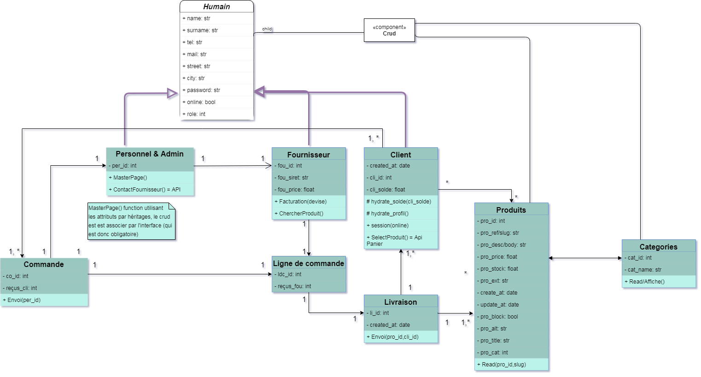
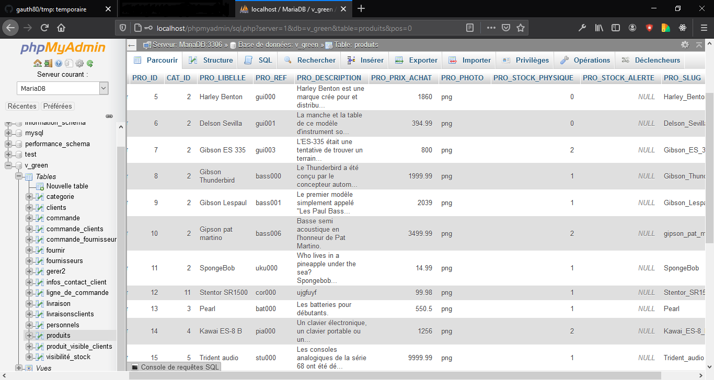

## Partie UML et SQL
Ici je traite seulement le diagramme de classe SQL du fil rouge.

### Avant propos:
Pour réaliser le fil rouge, nous devions faires des shémas UML et un mérise (mérise basée sur le diagramme de classe). Ces étapes étais indispensable pour réalisée la base de donnée, la base de donnée fut ensuite modifié et ré adaptée selon les besoins du site.

### Le Diagramme de cas d'utilisation
Il consiste à mettre en avant les cas d'utilisations de l'utilisateur sur un site web, il traite en soit les cas échéans (choix secondaire) et les cas primaire d'utilisation d'une applications. 


### Le Diagramme de classe
Conscient qu'il soit potentiellement faux, je peu au moins expliquée mon raisonnement. J'ai pensée plus aux comportements du **PHP** qu'au **SQL** c'est sans doute une erreur.

J'ai conssidérée que Personnel, Fournisseur et Client avais plus ou moins les mêmes attributs et fonctions, j'ai donc penssé à l'héritage (fleche violette) et la possibilitée de me projetée sur une éventuelle classe abstraite (d'où l'humain en italique).

Je pensée également à joindre les classes crud via une interface.

Je pensée aussi à l'hydratation pour les produits selectionnée par le clients notament pour l'application via le panier cela me semblée logique au départ.

Pareil pour la visibiltée des attribut, ci3 à du mal avec les élément protégée(protected).

Mon erreur à étais de pensé plus php que sql aux final.



### Cotée SQL
Niveau SQL on a utilisée Wamp (PHPMyAdmin - Apache - PHP7) un serveur open source connue plus pour le développement que pour la production.

PHPMyAdmin est l'interface faisant tournée les bases de données de WAMP, l'une est mySQL (la plus vielle) et l'autre mariaDB (la plus réçente).

Apache c'est le serveur de wamp, hormis faire fonctionnée les deux base de donnée, il peu aussi être modifier via des pages .httpaccess permettant par exemple des redirections possible sur des index de sites, une sorte de routage manuel en quelque sorte, par ailleur pour crée un virtualHost il faut définir la redirection via .httpaccess.

PHP 7 ou antérieur permet entre autre de se servir de php sur nos site, mais aussi de se servir de l'interface de phpMyAdmin, cette dernière etant programmée en ce langage.

### Vue d'ensemble de la table produits


### Vue catégories utilisée pour les produits


## Commande SQL
### Crée une table

```sql
CREATE TABLE IF NOT EXISTS `produits` (
  `PRO_ID` int(11) NOT NULL AUTO_INCREMENT,
  `CAT_ID` int(11) NOT NULL,
  `PRO_LIBELLE` varchar(50) DEFAULT NULL,
  `PRO_REF` varchar(50) DEFAULT NULL,
  `PRO_DESCRIPTION` varchar(500) DEFAULT NULL,
  `PRO_PRIX_ACHAT` float DEFAULT NULL,
  `PRO_PHOTO` varchar(255) DEFAULT NULL,
  `PRO_STOCK_PHYSIQUE` int(11) DEFAULT NULL,
  `PRO_STOCK_ALERTE` int(11) DEFAULT NULL,
  `PRO_SLUG` varchar(255) DEFAULT NULL,
  PRIMARY KEY (`PRO_ID`),
  KEY `FK_cat_id` (`CAT_ID`)
) ENGINE=InnoDB;

```
•   If not exist est facultatif.  
•   Int pour entier, entre parenthèse son occurence souhaitée.  
•   Varchar est pour les caractères, float pour les nombres flottant.  
•   Chaque table à besoin d'un id (identifiant) en AI (auto incrémentation).  
•   Les backtips ne sont pas obligatoire mais peuvent évitée les erreurs avec les mots clé entre autre.  
•   La clé primaire permet d'enregistrée les changements de la table.  
•   FK pour clé de contrainte, cela vérifie la bonne intégritée des données dans le champs concernée.  
•   Engine définit le moteur de la table, par défaut c'est MyISAM, MyISAM ne gère pas les FK ni les transaction.   
•   Le moteur Memory permet d'effectuée d'ancienne recherche fulltext (recherche peu précise).

### Inseré des données
```sql
INSERT INTO `produits` (`PRO_ID`, `CAT_ID`, `PRO_LIBELLE`, `PRO_REF`, `PRO_DESCRIPTION`, `PRO_PRIX_ACHAT`, `PRO_PHOTO`, `PRO_STOCK_PHYSIQUE`, `PRO_STOCK_ALERTE`, `PRO_SLUG`) VALUES
(5, 1, 'Harley Benton', 'gui000', 'une description', 1860, 'png', 0, NULL, 'Harley_Benton'),
(6, 1, 'Delson Sevilla', 'gui001', 'une description', 394.99, 'png', 0, NULL, 'Delson_Sevilla');

```
Notons qu'il n'est pas nécessaire d'attribuée une valeur à l'id, vue que se dernier est en AI.

### L'update des données
```sql
Update produits set PRO_LIBELLE = 'New Delson Sevilla', PRO_REF = 'gui005' where PRO_ID = 6

```
Pour une commande, il n'est pas nécessaire le point virgule.  

### delete et truncate
delete est particulier, si il n' y as de clause alors il supprime toutes les données.  
delete est différent de truncate, truncate vide les champs tandis que delete supprimes les donnée, le champs et surtout l'id référent.

```sql
truncate produits.PRO_REF where CAT_ID = 2 

```

### Jointure
Les Jointures permette de joindre les données de deux tables, cotée PHP cela permet par exemple de joindre les catégories avec les produits.

```sql
select produits.PRO_REF as ref, categorie.CAT_ID as id
    FROM produits as product
INNER JOIN categories ON product.PRO_ID = categorie.id


```
Ici je demande a voir la ref des produits, ainsi que l'id de catégorie.  
Je donne des Alias à la table produits pour évitée l'ambiguïté.  
INNER n'est pas très appréciée je suis conscient.  


